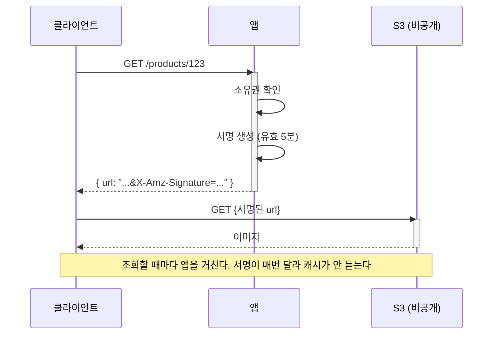
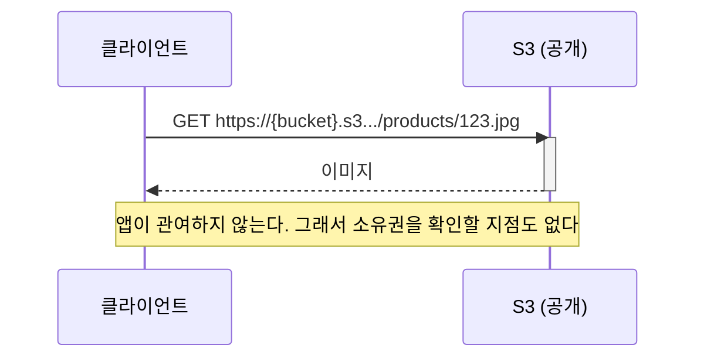
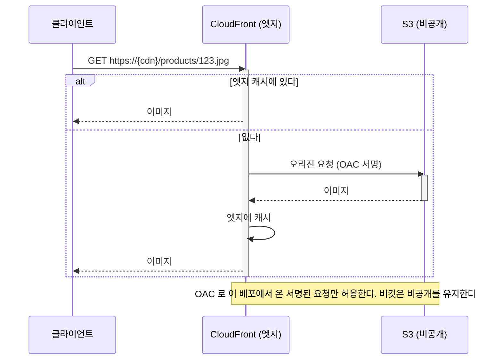
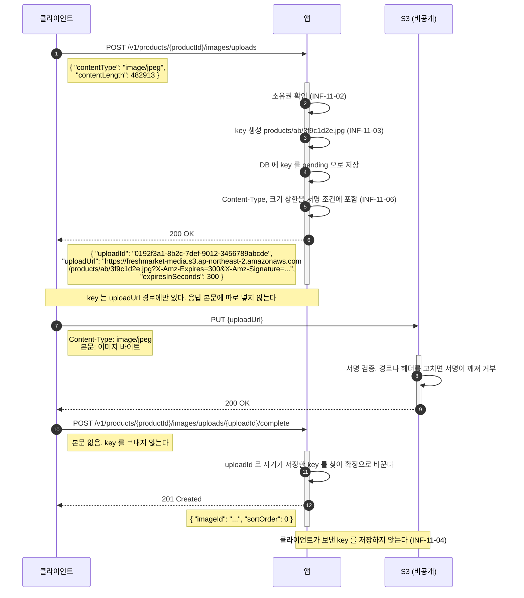
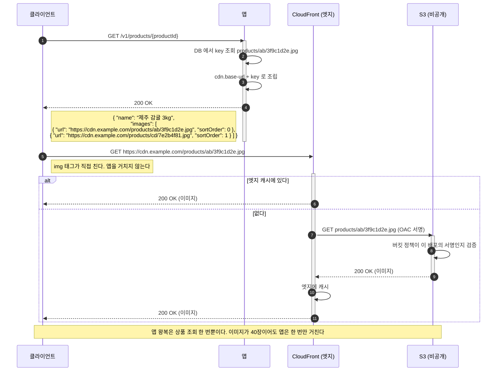
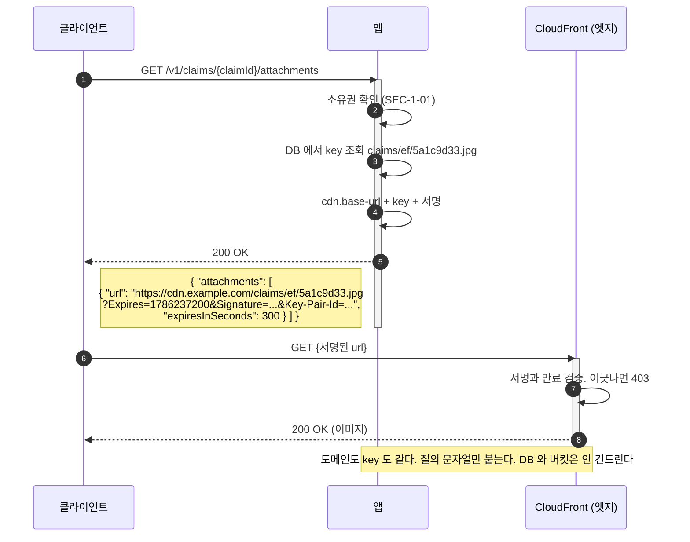

# 이미지 저장소: 설계 근거와 선택지 비교 (백엔드 공통)

작성 기준일: 2026-08-08
적용 대상: 신선식품 자사몰의 상품 이미지와 사용자 업로드 이미지
관련 문서: [백엔드공통_기술스택_확정문서.md](./백엔드공통_기술스택_확정문서.md), [백엔드공통_시스템디자인_종합.md](./백엔드공통_시스템디자인_종합.md)

**확정: CloudFront + OAC (3.3절)** 2026-08-08

이 문서는 그 결정의 근거로 남는다. 세 선택지를 비교한 내용은 그대로 둔다.
확정값은 기술 스택 확정 문서 2.6절과 5.2절에, 점검 항목은 `docs/infra-review/code-guideline.md` 11장에 있다.

---

## 1. 이미 정해진 것

| 항목 | 값 | 근거 |
|------|-----|------|
| 저장소 | S3 (ap-northeast-2) | 이미 Terraform 상태 저장에 사용 중 |
| 업로드 경로 | **presigned URL 로 클라이언트가 직접** | 앱 대역폭과 메모리를 쓰지 않는다 |
| 이미지 가공 | **없음. 원본만 저장** | 리사이징은 추가 인프라나 CPU 를 요구한다 |

업로드를 앱이 중계하지 않는 이유는 인스턴스가 `t3.small` 한 대이기 때문이다.
멀티파트 업로드를 앱이 받으면 톰캣 스레드가 파일 전송 시간만큼 잡히고, 요청 본문 크기 상한(`SEC-3-05`)도 함께 올려야 한다.

**남은 것은 "내려줄 때 어떻게 하는가" 하나다.**

## 2. 전제 조건

이 인프라의 확정 사항 중 판단에 영향을 주는 것들이다.

| 조건 | 값 | 영향 |
|------|-----|------|
| 앱 위치 | **퍼블릭 서브넷** | NAT 없이 S3 에 나갈 수 있다. VPC 엔드포인트가 필수는 아니다 |
| NAT Gateway | 없음 | 월 40 USD 절감이 목적. 이 결정은 되돌리지 않는다 |
| 월 예산 | 약 127 USD | 이미지 저장소가 큰 비중을 차지하면 안 된다 |
| 인스턴스 | `t3.small` x 1 | 버스트 크레딧에 의존한다. CPU 를 쓰는 선택은 불리하다 |

## 3. 선택지

### 3.1 presigned URL (비공개 버킷)



버킷은 완전 비공개다. 서명 없이는 아무도 못 읽는다.

**장점**

* `SEC-1-01`(리소스 접근 시 소유권 검증), `SEC-1-03`(목록 조회에도 소유자 조건)을 **앱이 완전히 통제**한다
* 버킷 공개 설정 자체가 없어 실수로 다른 파일이 노출될 여지가 없다
* 서명 만료로 링크 유출의 수명을 제한할 수 있다

**단점**

* **캐시가 안 된다.** URL 에 서명이 붙어 매번 달라지므로 브라우저도 CDN 도 재사용하지 못한다
* 조회할 때마다 앱을 거친다. 상품 목록 한 화면에 이미지 40장이면 서명 발급 40회다
* 같은 이미지를 100명이 보면 S3 에서 100번 전송된다. 전송비가 조회 수에 비례한다

**적합한 곳**: 주문서, 영수증, 본인만 봐야 하는 사진

### 3.2 퍼블릭 읽기 버킷



**장점**

* 가장 단순하다. 앱 부하가 0 이고 구성할 것이 버킷 정책 하나뿐이다
* URL 이 고정이라 브라우저 캐시가 그대로 듣는다
* 실패 지점이 적다

**단점**

* **소유권 검증이 원천적으로 불가능하다.** URL 을 아는 사람은 누구나 본다
* 버킷을 공개로 열어 두므로, 나중에 비공개 파일을 같은 버킷에 올리면 함께 노출된다
* 전송비는 조회 수에 비례한다. CDN 이 없어 엣지 캐시 이득이 없다

**적합한 곳**: 상품 카탈로그 이미지, 로고, 배너

### 3.3 CloudFront + OAC



**장점**

* 버킷이 비공개다. S3 URL 로 직접 접근하면 거부된다
* **엣지 캐시가 듣는다.** 같은 이미지의 두 번째 조회부터는 S3 를 안 거친다
* CloudFront 에는 상시 무료 구간이 있어(월 1TB 전송, 1000만 요청) 이 규모에서는 S3 직접 전송보다 쌀 가능성이 높다
* 나중에 서명된 쿠키나 URL 로 접근 제어를 얹을 수 있다. **구조를 안 바꿔도 된다**

**단점**

* 배포 하나가 추가된다. Terraform 구성, OAC, 버킷 정책이 늘어난다
* **무효화 정책이 생긴다.** 이미지를 교체했는데 엣지 캐시가 남는 문제를 다뤄야 한다
* 디버깅 계층이 하나 는다. 안 보이는 이미지의 원인이 S3 인지 CloudFront 인지 갈린다
* 배포 전파에 시간이 걸려 초기 구축과 변경이 즉시 반영되지 않는다

**적합한 곳**: 공개 이미지가 많고 조회가 잦은 경우

## 4. 비용

### 4.1 단가 (등급 C. 서울 단가 미검증)

**아래 값은 확인하지 않았다.** 기술 스택 확정 문서 5.1절이 밝힌 대로 총액의 상당 부분이 추정치이며, 이 표도 같은 상태다.
구축 확정 전에 AWS 요금 계산기로 검증한다.

| 항목 | 추정 단가 | 비고 |
|------|-----------|------|
| S3 Standard 저장 | 약 0.025 USD/GB/월 | |
| S3 GET 요청 | 약 0.0004 USD/1000건 | |
| S3 PUT 요청 | 약 0.005 USD/1000건 | 업로드 |
| S3 인터넷 전송 | 약 0.126 USD/GB | **비용의 대부분** |
| CloudFront 전송 | 약 0.12 USD/GB | 월 1TB 까지 무료 구간 |
| CloudFront 요청 | 약 0.009 USD/1만건 | 월 1000만건까지 무료 구간 |
| CloudFront 오리진 요청 | 0 USD | S3 와 같은 리전이면 전송비 없음 |

### 4.2 가정한 사용량 (등급 C)

**실측 전이라 전부 가정이다.** 규모가 달라지면 결론이 바뀔 수 있다.

| 항목 | 가정 |
|------|------|
| 상품 수 | 500개 |
| 상품당 이미지 | 3장 |
| 이미지 크기 | 300KB (원본만 저장하므로 큰 편) |
| 저장 총량 | 약 0.45GB |
| 월 이미지 조회 | 30만건 (목록 화면 중심) |
| 월 전송량 | 약 90GB |

### 4.3 선택지별 월 비용 (등급 C)

| 항목 | presigned | 퍼블릭 읽기 | CloudFront |
|------|-----------|-------------|------------|
| 저장 (0.45GB) | 0.01 | 0.01 | 0.01 |
| GET 요청 (30만) | 0.12 | 0.12 | 0.12 (오리진은 캐시 적중분만) |
| 전송 (90GB) | **11.34** | **11.34** | **0** (무료 구간 내) |
| CloudFront 요청 | - | - | 0 (무료 구간 내) |
| **합계** | **약 11.5 USD** | **약 11.5 USD** | **약 0.2 USD** |

**전송비가 전부를 가른다.** 저장과 요청은 어느 쪽이든 소액이다.

CloudFront 가 싼 이유는 무료 구간 때문이며, 월 1TB 를 넘으면 S3 직접 전송과 비슷해진다.
다만 캐시 적중분은 오리진 전송이 발생하지 않으므로, 넘더라도 S3 직접보다 유리하다.

**presigned 는 캐시가 안 되므로 실제 전송량이 더 클 수 있다.** 브라우저 재방문에서도 다시 받는다.

## 5. 비교

| | presigned | 퍼블릭 읽기 | CloudFront + OAC |
|---|---|---|---|
| 버킷 공개 | 비공개 | **공개** | 비공개 |
| 소유권 검증 | **가능** | 불가능 | 조건부 (서명 쿠키 추가 시) |
| 브라우저 캐시 | **안 됨** | 됨 | 됨 |
| CDN 캐시 | 안 됨 | 안 됨 | **됨** |
| 앱 부하 | 조회마다 서명 | 없음 | 없음 |
| 월 비용 (가정 기준) | 약 11.5 USD | 약 11.5 USD | **약 0.2 USD** |
| 구성 복잡도 | 낮음 | **가장 낮음** | 높음 |
| 나중에 접근 제어 추가 | 이미 있음 | **어렵다** | 가능 |

## 6. 판단

### 6.1 URL 이 만들어지는 방식

**DB 에는 key 만 둔다.** URL 은 조회할 때 조립한다.

```
DB    products/ab/3f9c1d2e.jpg                 <- key. 이것만 저장한다
설정  cdn.base-url: https://cdn.example.com    <- 프로파일마다 다르다
      s3.bucket-url: https://freshmarket-media.s3.ap-northeast-2.amazonaws.com

조회  https://cdn.example.com/products/ab/3f9c1d2e.jpg
업로드 https://freshmarket-media.s3.ap-northeast-2.amazonaws.com/products/ab/3f9c1d2e.jpg?X-Amz-Signature=...
```

**같은 key 에 도메인만 다르게 붙는다.** 조회는 CloudFront, 업로드는 S3 다.
CloudFront 는 경로를 변환하지 않고 그대로 객체 key 로 오리진에 묻는다. 그래서 도메인만 갈아 끼우면 된다.

전체 URL 을 저장하면 셋을 잃는다.

| 상황 | 전체 URL 을 저장했을 때 |
|------|------------------------|
| 도메인 교체, 커스텀 도메인 연결 | 전 행을 UPDATE 해야 한다 |
| 환경별로 도메인이 다름 | 운영 데이터를 스테이징에서 못 쓴다 |
| 비공개 이미지로 전환 | **불가능하다.** 서명은 발급할 때마다 달라지는데 저장된 값은 고정이다 |

세 번째가 결정적이다. CloudFront + OAC 를 고른 이유가 "나중에 서명 URL 을 얹어도 구조를 안 바꾼다" 인데,
URL 을 통째로 저장하면 **그 이유 자체가 성립하지 않는다.** `INF-11-05` 가 이것을 점검한다.

**key 는 서버가 만든다.**

```
products/{두 글자}/{난수}.jpg
```

클라이언트가 준 파일명을 쓰지 않는다. 경로 조작과 덮어쓰기가 가능해지기 때문이다 (`INF-11-03`).
앞 두 글자는 한 프리픽스에 객체가 몰리지 않게 나눈 것이다.

**공개 여부를 경로에 넣지 않는다.** 리뷰처럼 공개 여부가 운영 중에 바뀌는 것이 있어,
경로에 넣으면 토글 한 번이 객체 이동과 DB 수정이 된다.

### 6.2 채택안

**CloudFront + OAC 를 택했다.** 버킷은 하나이고 비공개다.

* 버킷을 공개하지 않으면서 캐시를 얻는다
* 비용이 가장 낮다 (가정 기준)
* 비공개 이미지가 생겨도 저장 구조와 key 를 그대로 둔 채 URL 발급만 바꾼다

구성이 늘어나는 것이 유일한 대가이며, Terraform 을 어차피 새로 쓰는 시점이므로 초기 비용으로 흡수된다.

#### 업로드



**업로드 URL 은 S3 호스트다.** presigned PUT 은 오리진에 직접 서명하는 것이라 구조상 그렇다.
`INF-11-01`(조회 URL 이 CloudFront 도메인인가)의 예외이며, 그 항목은 조회용 URL 을 대상으로 한다.

**완료 통지 본문에 key 가 없는 것이 요점이다.** key 를 돌려받아 저장하면 남의 key 를 실어 보내
남의 이미지를 자기 리소스에 붙일 수 있다. presigned 서명은 **올리는 것**만 막지 **저장하는 것**은 막지 못한다.

#### 조회

이미지 한 장마다 앱을 부르지 않는다. **리소스 응답에 URL 이 실려 나가고 브라우저가 CloudFront 를 직접 친다.**



#### 비공개 이미지가 생기면

저장은 그대로 두고 **URL 을 만드는 코드에만 서명을 더한다.**



공개 여부가 행마다 갈리는 것(리뷰, QnA)은 **비공개 행에 URL 자체를 안 준다.**

```
GET /v1/products/{productId}/reviews

200 {
  "reviews": [
    { "id": "...", "isPublic": true,  "images": [ { "url": "https://cdn.example.com/reviews/1a/9f3c2e08.jpg" } ] },
    { "id": "...", "isPublic": false, "images": [] }
  ]
}
```

URL 을 주고 접근을 막으면 그 URL 은 이미 새어 나간 것이다.
`SEC-1-03`(목록 조회에서도 소유자 조건이 쿼리에 포함되는가)이 이 자리이며, 목록을 만들 때 걸러야지 응답을 만든 뒤 지우면 늦다.

### 6.3 지금 결정하지 않아도 되는 것

| 항목 | 정해야 할 때 |
|------|--------------|
| presigned 만료 시간 | 업로드 구현 시 |
| 무효화 정책 (CloudFront 채택 시) | 이미지 교체 기능이 생길 때 |
| 버킷 수명 주기 (오래된 이미지 정리) | 저장량이 문제될 때 |
| 리사이징 도입 | 원본 전송량이 문제될 때 |

## 7. 정해지면 반영할 곳

| 문서 | 무엇을 |
|------|--------|
| `백엔드공통_기술스택_확정문서.md` 2.6절 | AWS 리소스 표에 S3 버킷과 CloudFront |
| 같은 문서 5.2절 | 월 운영 비용에 추가 |
| `docs/infra-review/code-guideline.md` | 점검 항목 (버킷 공개 여부, presigned 만료, 업로드 검증) |
| `docs/infra-review/pending-decisions.md` | 결정되면 해당 항목 제거 |

점검 항목은 `SEC-3-04`(파일 업로드에서 확장자, MIME 타입, 크기, 저장 경로를 검증하는가)와 겹친다.
**일반론은 `LGU-2/.github` 가 갖고, 이 인프라의 확정값(버킷 이름 규칙, 만료 시간 등)은 여기가 갖는다.**
